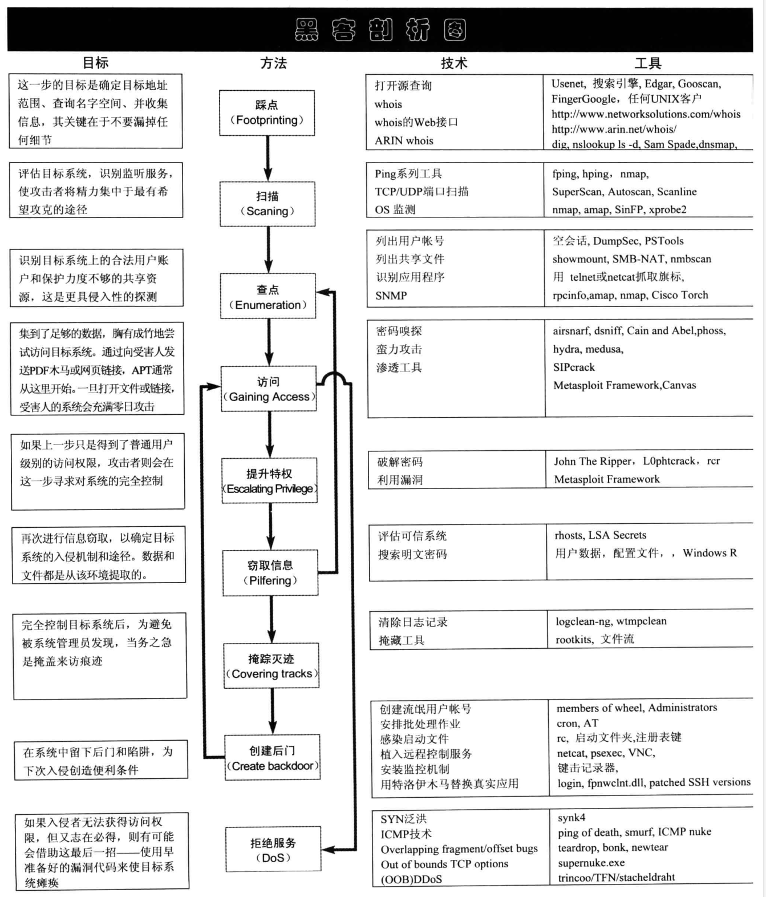
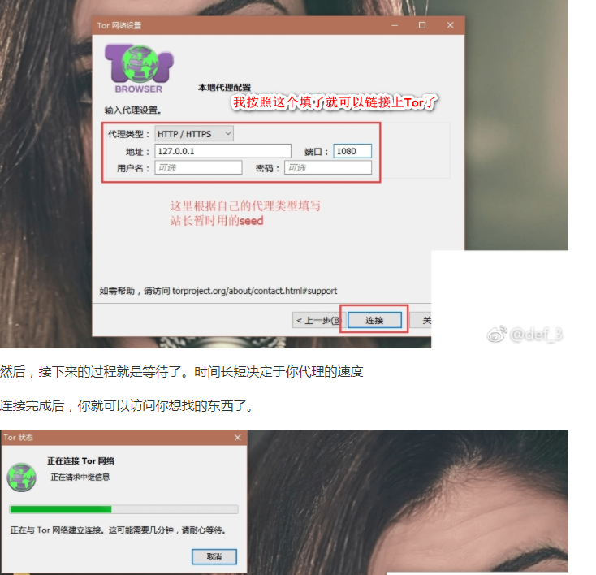
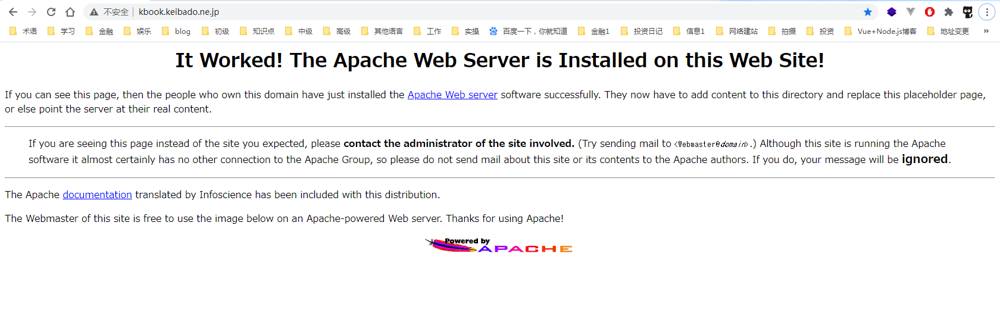

(注1：有时间的时候可以看一下这本书，原因是偶然看到了一个问题，看到里面推荐了这本书。[大龄、零基础，想转行做网络安全。怎样比较可行？](https://www.zhihu.com/question/27412555))

(注2：但是我现在也没有时间去看网络安全有关的书了，等以后有机会了好好看看吧。)

(注3：看这本书，一定要科学上网，跟着书上的步骤自己动手实践一次。)

# 序言

最近十几年来，“信息安全”这一名词的使用范围越来越广泛，其概念已经不仅是保护大公司和企业的商业机密，而且包括保护大众消费者的网络隐私。我们大量的敏感信息都保存在网络上，不法分子使用各种工具去窃取他人的保密数据的动机是如此强烈，以致于我们无法置之不理。而且，目前颁布的法律对网络犯罪起到的震慑作用似乎还不够有效。

术语网络安全和一张以“网络”作为前缀的无穷的单词表每天都冲击着我们的感官。计算机和信息技术是让我们这个世界相互关联和依存的关键因素，虽然人们广泛讨论到计算机和信息技术领域的多种术语，但是对这些术语的理解往往不到位。政府、私营和合资企业以及个人都逐渐意识到我们日常生活中的在线活动所面临的挑战和威胁。在近几年内，世界范围内依赖于计算机进行存储、访问和交换信息的速度呈现指数级增长，这涵盖几乎全球依仗计算机操作或计算机辅助基础设施和工业机制，由此可见，网络对我们生活的重要性是显而易见的。

安全问题所导致的影响范围小到因其所带来的不便，大到严重的商业损失，乃至国家的安全隐患。黑客攻击是网络不安全的罪魁祸首，其所造成的危害包括令人不快却相对无害的年轻人的爱开玩笑活动，到由政府发起的以及由专业黑客发起的危害巨大的、复杂的且有目标的网络攻击活动。

上一版的《黑客大曝光》被公认为是网络安全的基础文档，是IT专家、技术领袖以及其他人员有兴趣了解黑客及其方法的重要文献。但是作者意识到，要想在快速变化的IT安全领域保有一席之地，需要机敏、洞察力以及对最新黑客攻击活动和技术的深入理解。借用《罗宾汉》电影中的台词，“不断进步…，以此勉励我们应对网络黑客无休止入侵而需要付出不懈的安全努力。

本书第7版对由来已久的那些安全问题做了内容更新，并增加了有关针对特定目标的持续性攻击（Advanced Persistent Threats，APTs）、硬件以及嵌入式系统的新章节。书中解释了黑客入侵如何发生、渗透者在干什么以及如何抵御他们，作者涵盖了计算机安全的所有方面。鉴于移动设备和社交媒体的流行，今天的网民也可以在本书中找到在此类常见平台的漏洞和隐患的精彩内容。

处理IT和计算机安全问题的前提条件是知识。首先，我们必须了解所使用的系统的架构及其软硬件的优点和缺点。其次，我们必须了解敌手：他们是谁以及他们要试图做什么。简而言之，在我们能够采取有效的应对措施之前，需要通过侦查和分析以洞悉有关的威胁和敌手。本书提供了必需的基础知识，武装那些真正关心网络安全的人们。

如果我们变得聪明并了解自己，了解我们的设备、网络和敌手，我们将能够成功地找到一种可以保护网络的方法。不变的是改变的现实：新技术和方法的出现，不断演变的威胁。因此我们必须“不断进步”以保持同新发展齐头并进，更新知识并获得对黑客攻击全面而深入的了解。

新版本的《黑客大曝光》将帮助你变得聪明，并采取有效的措施。小绵羊终将成为网络安全界的狮子。

​																																		    William J.Fallon
​																																			美国海军上将（退役）
​																																			CounterTack公司主席

海军上将William J.Fallon在经历了40年的辉煌战事和战略生涯之后从美国海军退役。他领导美国和盟军的8个独立纵队，在美国政府最高级别的战事和外交事务中扮演了领导角色。

作为美国中央司令部的首脑，海军上将Fallon指挥了美国在中东、中亚和非洲之角的军事行动，主要有对伊拉克和阿富汗的联合行动。Fallon上将是网络安全领域新兴公司CounterTack公司的理事会主席，他同时还是Tilwell Petroleum有限责任公司的合伙人、多家商业公司的顾问以及Naval Analyses中心的杰出成员。他还是美国国防科学局秘书组和美国安全项目组的成员。

# 第一部分：收集情报

## 案例研究

正如你们将在下面章节中看到的，**踩点、扫描及查点**是情报收集中至关重要的概念。正如一个银行抢劫者在实施最后致命一击之前会搜集银行的相关情报一样，你的网络敌手也会做同样的事情。他们有计划地进行探查，直到找出你在网络中最易受攻击的软肋。

而且，这并不需要花多长的时间。

指望那些坏家伙在使用网络扫描工具时还是打开所有选项，比如Nmap，已经是1999年（碰巧那一年我们写了第一版的《黑客大曝光》）的古老想法了。现在，这些家伙变得更加狡猾，他们知道藏匿行踪对于一个成功的黑客的重要性。也许我们需要稍微深入讨论一下。

## 都是匿名和无知惹的祸

随着因特网的发展，保护隐私已成为一种独特的需求。很多开发出来的系统具有实用价值的同时也提供强有力的匿名保护。相比于**洋葱路由器**（The Onion Router，或简称Tor）系统，大多数系统做得显然不够。Tor系统基于洋葱路由器，是第二代低延迟匿名系统，用户可通过它在因特网上进行匿名通信。Tor系统最初由美国海军研究实验室赞助，随后于2004年成为电子前沿基金会（Electronic Frontier Foundation，FFF）的项目。洋葱路由可能听起来和“铁人料理”之类的电视节目有些关系，但实际上它是提供网络匿名通信的相当复杂的一门技术。洋葱路由志愿者在系统上提供一个洋葱代理服务器，用户通过这个代理以TCP协议在Tor网络上对外进行匿名通信。Tor网的使用者必须在他们的系统上运行一个洋葱代理，这个代理允许他们在Tor网络上进行通信，并协商一个虚拟链路。Tor之所以名为洋葱路由，是因为其按照层级实施高级加密。在所有的匿名网络中，Tor最重要的优势在于其独立于应用，在TCP数据流层工作。它可以支持SOCKS代理，一般能够用于即时通信、因特网中继聊天系统（Internet Relay Chat，IRC）及Web浏览。尽管目前还达不到100%的安全和稳定，Tor已经是运用于因特网上匿名通信的一项惊人进步。

当大多数人在Tor网上享受匿名访问带来的便利时，Joe Hacker似乎更喜欢用它给你捣乱。Joe知道入侵侦测及匿名技术已得到了长足发展。他也知道，如果他想继续执行他认为天赐的权力-入侵你的系统，他需要隐匿自己的行踪。让我们窥视一下他隐藏形迹的几种方式。

## 利用Tor折磨好人

Joe Hacker是一个以搜寻、破坏系统为乐趣的专家。他的惯用伎俩是使用Nmap来扫描开放式服务（如Web服务或Windows文件共享服务），当然，他非常精通于在Tor网用“忍术”掩藏自己的身份。让我们进入他的世界并检验一下他的手艺如何。

Joe的首要任务是确保自己能进行匿名访问。除此之外，他也想确保浏览器（在泄露信息方面臭名昭著）在Tor网中不会暴露关于他的信息。他决定**下载并安装Tor的客户端Vidalia**（Tor的图形界面版本），以及**Privoxy**（一个网页过滤代理）来保证匿名操作。他单击http://www.torproject.org/download.html.en下载了一个包含了这些软件的完整包。

[洋葱浏览器使用配置教程](https://weibo.com/ttarticle/p/show?id=2309404195758629883200)

**Torbutton**是Vidalia安装的一个**组件**，它可以快速、简单地启用、禁用通过Tor网络（https://addons.mozilla.org/en-US/firefox/addon/2275）的访问。通过一些快速配置，Tor代理完成安装并开始监听本地9050端口，Privoxy完成安装并开始监听8118端口，Firefox右下角区域上扩展的Torbutton组件随时可用。他链接到Tor的确认网页（https://check.torproject.org），网页反馈成功：“祝贺你。你正使用Tor。"登录完成后，他开始搜寻以默认方式安装的Web服务器。**Google**是一个搜寻所有目标的好方法，Joe**在搜索栏中**输入以下内容：

~~~
intitle:Test.Page.for.Apache "It worked!" "this web site!"
~~~

立即，一份以默认方式安装运行的Apache Web服务器上的系统清单展示出来。因为知道自己的IP是匿名的，并且极小可能会追踪到他的行迹，他无后顾之忧地点击了链接。接下来的是再熟悉不过的，“成功了，这个站点安装好了Apache Web服务器！"，游戏开始了。

现在，既然有了你的Web服务及其关联的域名信息，他打算把这些信息解析为具体的IP地址。但是如果仅使用host命令，那样会暴露他的位置。他使用Tor包中的`tor-resolve`工具来完成解析。Joe Hacker知道，不应该使用任何直接向目标系统发送UDP或ICMP包的工具，所有的查找必须经由Tor网络来确保匿名。

~~~
bt ~ # tor-resolve www.example. com
10.10.10.100
~~~

> 注意：`www.example.com`和10.10.10.100仅作为举例使用，非真实IP地址或域名。